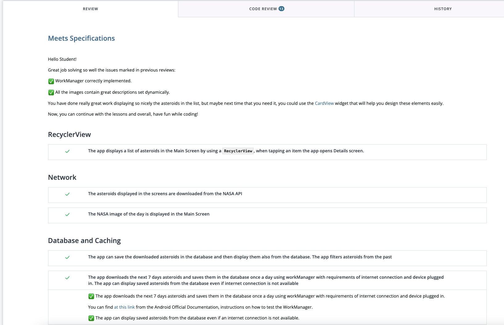
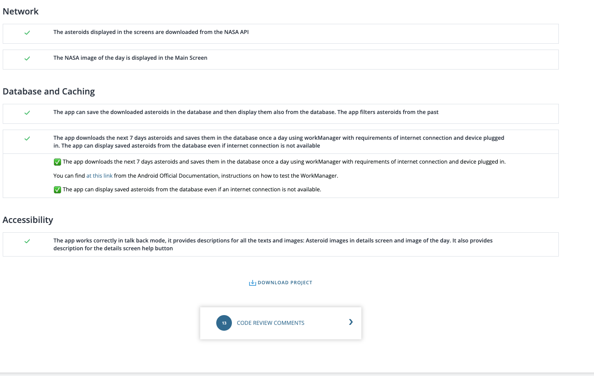

## Note: Android Kotlin Gradle Update
Use the updated Gradle version in the `~/gradle/wrapper/gradle-wrapper.properties` file:
```
distributionUrl = https\://services.gradle.org/distributions/gradle-6.1.1-all.zip
```
# The Asteroid Project

|Home|Details|Details|Info|
|--|---|---|----------------------|---|
||||  |


1. Asteroid Radar is an app to view the asteroids detected by NASA that pass near Earth.
2. You can view all the detected asteroids given a period of time with data such as the size, velocity, distance to earth and if they are potentially hazardous.
3. In this project, you will apply the skills such as fetching data from the internet, saving data to a database, and display the data in a clear, compelling UI.

## Getting Started

Open the starter project in the latest stable version of Android Studio.

Open the starter project in Android Studio


## Review from the Reviewer (Udacity)

||

---

## License

```
Copyright 2023

Licensed under the Apache License, Version 2.0 (the "License"); 
you may not use this file except in compliance with the License. 
You may obtain a copy of the License at

   http://www.apache.org/licenses/LICENSE-2.0
   
Unless required by applicable law or agreed to in writing, software
distributed under the License is distributed on an "AS IS" BASIS,
WITHOUT WARRANTIES OR CONDITIONS OF ANY KIND, either express or implied.
See the License for the specific language governing permissions and
limitations under the License.
```